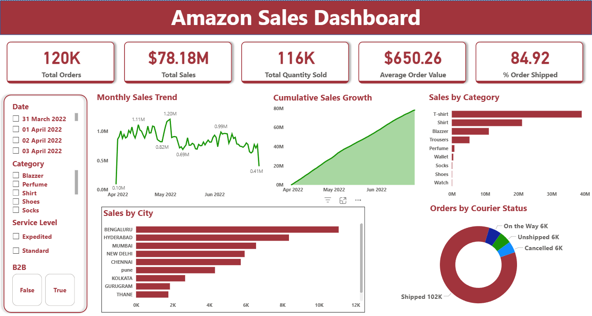

# Amazon Supply Chain Analytics Project (Excel, SQL & Power BI)

## 📌 Project Overview
This project focuses on building a **Supply Chain & Sales Analytics dashboard** using **Excel, SQL, and Power BI**.  
The objective is to analyze sales performance, demand trends, and logistics efficiency, and present insights in a clean, recruiter-friendly dashboard.

---

## 🎯 Key Business Objectives
- Analyze overall sales and order performance
- Track monthly sales trends and cumulative growth
- Understand product category contribution
- Identify regional demand patterns
- Compare B2B vs B2C sales behavior
- Evaluate shipping service levels and delivery status

---

## 🛠️ Tools & Technologies
- **Microsoft Excel** – Data cleaning and preprocessing  
- **SQL (PostgreSQL)** – Data analysis and querying  
- **Power BI** – Dashboard creation and visualization  

---

## 📂 Dataset Description
The dataset contains order-level sales data with information on:
- Order details (order ID, date, quantity, amount)
- Product category and size
- Shipping service level
- Courier delivery status
- City and state information
- B2B vs B2C order type

---

## 🧹 Data Cleaning (Excel)
The following steps were performed in Excel:
- Removed duplicate records
- Standardized column names
- Fixed date formats
- Handled missing and inconsistent values
- Created helper columns for month and year analysis
- Prepared clean datasets for SQL import

---

## 🧮 SQL Analysis
SQL was used to answer real business questions such as:
- Total orders, sales, and quantity sold
- Category-wise and city-wise sales performance
- Monthly sales trends
- B2B vs B2C comparison
- Shipping service level analysis
- Courier status distribution

**SQL concepts used:**
- `SUM()`, `COUNT()`, `AVG()` – revenue, order volume, and quantity calculations  
- `GROUP BY`, `HAVING`, `WHERE` – aggregation and filtering  
- Window functions: `SUM() OVER()`, `SUM() OVER (PARTITION BY …)` – percentage contribution analysis  
- `CASE WHEN` – conditional logic (order status, classifications)  
- `COALESCE()` – handling NULL values  
- `EXTRACT()` – year, month, and week-based trend analysis  
- `ORDER BY`, `LIMIT` – ranking and Top-N analysis  
- Subqueries and CTEs – modular and readable query design

---

## 📊 Power BI Dashboard
The final output is an **interactive dashboard** designed for quick business understanding.

### Dashboard Highlights:
- KPI cards for:
  - Total Orders
  - Total Sales
  - Total Quantity Sold
  - Average Order Value
  - % Orders Shipped
- Monthly Sales Trend (Line Chart)
- Cumulative Sales Growth (Running Total)
- Category-wise Sales Performance
- B2B vs B2C Sales Comparison
- Top Cities by Order Volume
- Shipping Service Level vs Orders
- Courier Status Distribution
- Interactive slicers for:
  - Date
  - Category
  - Shipping Service Level
  - B2B/B2C

📸 **Dashboard Preview:**

---

## 💡 Key Insights
- Sales show a steady month-over-month growth trend
- A few categories contribute the majority of revenue
- Order demand is concentrated in specific cities
- B2C orders dominate total sales volume
- Shipping service level has a visible impact on order volume
- Most orders are successfully shipped, indicating stable logistics performance

---

**Arpita Badatia**  
Aspiring Data Analyst | SQL | Power BI | Excel
